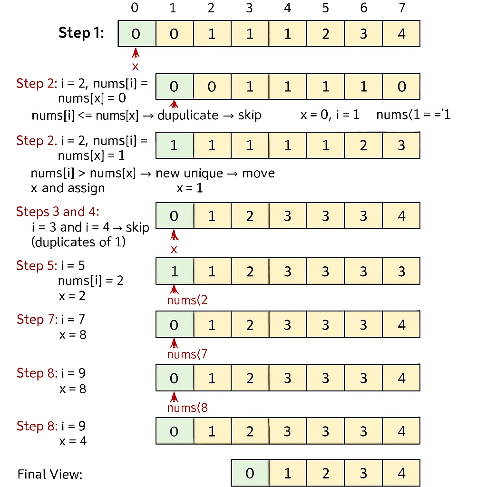

## 🧹 REMOVE DUPLICATES (Dry Run for Revision)

✅ Problem Statement:
Given an integer array `nums` sorted in **non-decreasing order**, remove the **duplicates in-place** such that each **unique element appears only once**. The relative order of the elements should be maintained. Return the number of unique elements in `nums`.

---

### 📌 Requirements:

- Let `k` be the number of unique elements.
- Modify `nums` in-place so that the **first `k` elements** are the unique values in the original order.
- The rest of the array values don’t matter after `k`.
- Return the value of `k`.

---

### 🧠 Approach (Code):

```js
var RemoveDuplicates = function (nums) {
    let x = 0;
    for (let i = 0; i < nums.length; i++) {
        if (nums[i] > nums[x]) {
            x = x + 1;
            nums[x] = nums[i];
        }
    }
    return x + 1;
}

const result = [0, 0, 1, 1, 1, 2, 2, 3, 3, 4];
const uniqueCount = RemoveDuplicates(result);
```

### 🔍 Explanation:

Initialize x = 0 (pointer for the last unique element).

Loop through each element at index i:

If nums[i] > nums[x], it’s a new unique element.

Move x forward.

Copy nums[i] to nums[x].

This process compacts all unique values into the first k = x + 1 elements.

### 📊 Dry Run Table:

```js
nums = [0, 0, 1, 1, 1, 2, 2, 3, 3, 4]
x = 0

```

| i | nums\[i] | nums\[x] | Condition (`nums[i] > nums[x]`) | Action            | x | Updated nums (partial)          |
| - | -------- | -------- | ------------------------------- | ----------------- | - | ------------------------------- |
| 0 | 0        | 0        | false                           | —                 | 0 | \[0, 0, 1, 1, 1, 2, 2, 3, 3, 4] |
| 1 | 0        | 0        | false                           | —                 | 0 |                                 |
| 2 | 1        | 0        | true                            | x=1; nums\[1] = 1 | 1 | \[0, 1, 1, 1, 1, 2, 2, 3, 3, 4] |
| 3 | 1        | 1        | false                           | —                 | 1 |                                 |
| 4 | 1        | 1        | false                           | —                 | 1 |                                 |
| 5 | 2        | 1        | true                            | x=2; nums\[2] = 2 | 2 | \[0, 1, 2, 1, 1, 2, 2, 3, 3, 4] |
| 6 | 2        | 2        | false                           | —                 | 2 |                                 |
| 7 | 3        | 2        | true                            | x=3; nums\[3] = 3 | 3 | \[0, 1, 2, 3, 1, 2, 2, 3, 3, 4] |
| 8 | 3        | 3        | false                           | —                 | 3 |                                 |
| 9 | 4        | 3        | true                            | x=4; nums\[4] = 4 | 4 | \[0, 1, 2, 3, 4, 2, 2, 3, 3, 4] |


### ✅ Final Result:
uniqueCount = 5

Modified result array (first 5 elements): [0, 1, 2, 3, 4]


## Visual Dry Run: Remove Duplicates in-place



