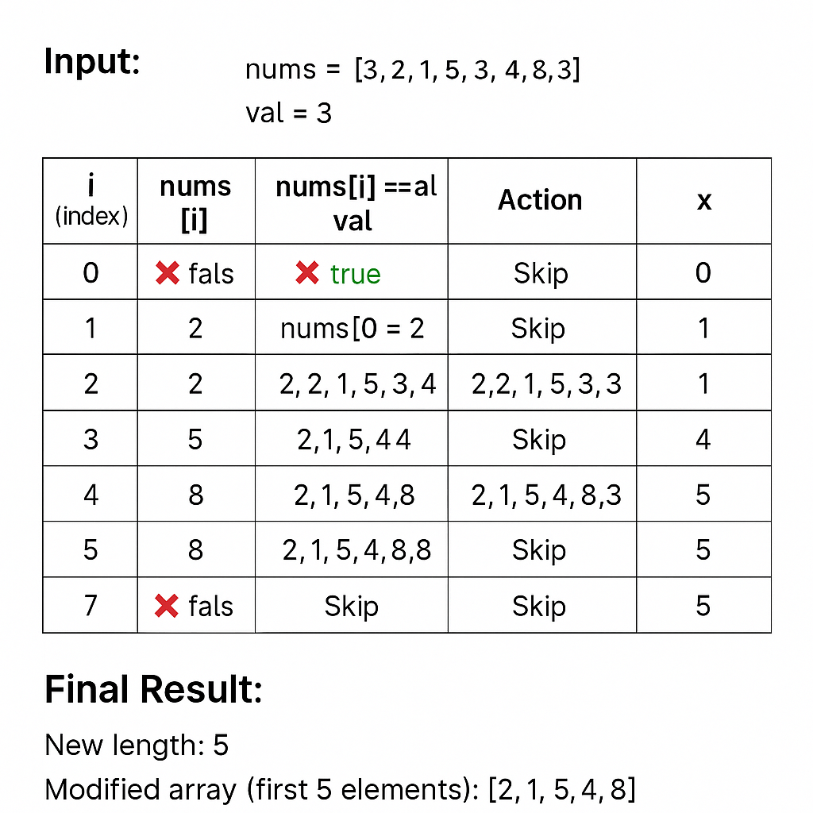

## 🧪 Dry Run: Remove Element from Array (In-place)

✅ Problem Statement
Given an integer array nums and a value val, remove all occurrences of val from the array in-place and return the new length. The relative order of the remaining elements may be changed.

---

### 🧠 Approach (Code):


```js
var RemoveElement = function (nums, val) {
    let x = 0;
    for (let i = 0; i < nums.length; i++) {
        // Shift elements to the left if not equal to val
        if (nums[i] !== val) {
            nums[x] = nums[i];
            x = x + 1;
        }
    }
    return x;
}

let result = [3, 2, 1, 5, 3, 4, 8, 3];
let newLength = RemoveElement(result, 3);
console.log(`The number of removed elements is ${result.length - newLength}`);
console.log(`The new array is: ${result.slice(0, newLength)}`);
```
### 🔍 Explanation:

## 📘 Explanation: Remove Element In-Place

This JavaScript function removes all occurrences of a specified value from an array in-place, meaning no extra space is used. Instead, it modifies the original array by overwriting the values to retain only the elements that are not equal to val.

---

### 🔧 How It Works:

1. A variable `x` is used as a **pointer** to track the position where the next valid (non-matching) element should be placed.
2. The function loops through each element of the array `nums`.
3. For each element:
   - If it **is not equal** to the target value `val`, it is moved to the index `x`, and `x` is incremented.
   - If it **is equal** to `val`, it is skipped (not copied).
4. After the loop ends, `x` represents:
   - The **new length** of the array without the removed elements.
   - The **first `x` elements** of the array now contain the updated result.

---

### 🧠 Why It’s Efficient:

- ✅ **Time Complexity:** `O(n)` – The array is traversed only once.
- ✅ **Space Complexity:** `O(1)` – No additional space is used; changes are made in the original array.

---

### ✅ Example:

### 🔧 Input:

```js
nums = [3, 2, 1, 5, 3, 4, 8, 3]
val = 3
```
✅ Initial Setup:


🔁 Step-by-Step Iteration:


| `i` (index) | `nums[i]` | `nums[i] !== val` | Action        | Updated Array             | `x` |
| ----------- | --------- | ----------------- | ------------- | ------------------------- | --- |
| 0           | 3         | ❌ false           | Skip          | \[3, 2, 1, 5, 3, 4, 8, 3] | 0   |
| 1           | 2         | ✅ true            | `nums[0] = 2` | \[2, 2, 1, 5, 3, 4, 8, 3] | 1   |
| 2           | 1         | ✅ true            | `nums[1] = 1` | \[2, 1, 1, 5, 3, 4, 8, 3] | 2   |
| 3           | 5         | ✅ true            | `nums[2] = 5` | \[2, 1, 5, 5, 3, 4, 8, 3] | 3   |
| 4           | 3         | ❌ false           | Skip          | No change                 | 3   |
| 5           | 4         | ✅ true            | `nums[3] = 4` | \[2, 1, 5, 4, 3, 4, 8, 3] | 4   |
| 6           | 8         | ✅ true            | `nums[4] = 8` | \[2, 1, 5, 4, 8, 4, 8, 3] | 5   |
| 7           | 3         | ❌ false           | Skip          | No change                 | 5   |

 ### ✅ Final Result::

- ✅ New length: 5

- ✅ Modified array: [2, 1, 5, 4, 8, _, _, _]

    - Only the first 5 elements are valid after removal.
    
- Modified Array (first 5 elements): [2, 1, 5, 4, 8]

## Visual Dry Run: Remove Element from Array (In-place)

